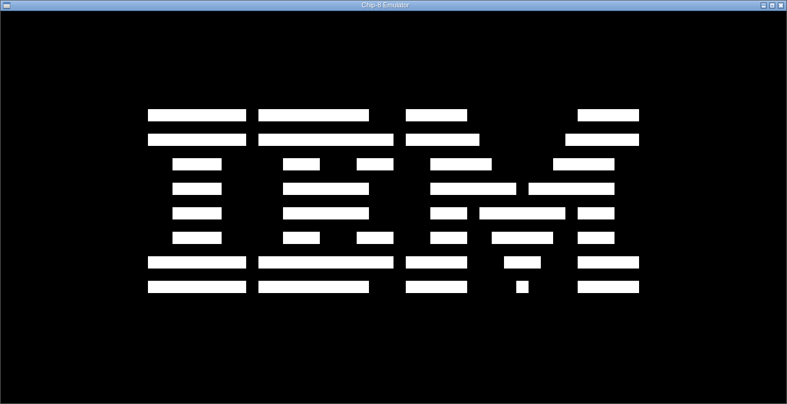

# Chip-8

Interpretador de CHIP-8 escrito em C, utilizando SDL2 para renderização e entrada. Compatível com Windows e Linux via CMake.

CHIP-8 é uma linguagem interpretada criada na década de 1970 para execução de jogos simples em microcomputadores como o COSMAC VIP.

<p align="center">
    
</p>

<p align="center">
    <sub>Logo da IBM no emulador do CHIP-8</sub>
</p>

---

## Status do projeto

O conjunto de instruções está completamente implementado. Todos os 35 opcodes da especificação original do CHIP-8 estão cobertos em `chip8_execute` (`src/chip8.c`), incluindo:

- `8XY6` / `8XYE` — shift de registradores (variante COSMAC VIP, operando apenas sobre `VX`)
- `8XY5` / `8XY7` — subtração com flag de borrow em `VF`
- `FX55` / `FX65` — load/store de memória a partir do índice `I`
- `FX0A` — espera bloqueante por tecla
- `DXYN` — desenho de sprite via XOR, com detecção de colisão

Não há opcodes pendentes de implementação. O core do interpretador é considerado funcionalmente completo.

### Nota sobre o display

O desenho de sprites (`DXYN`) utiliza XOR sobre o framebuffer, conforme a especificação original do CHIP-8. Isso significa que sprites redesenhados em sequência (padrão comum em ROMs de animação) produzem um efeito de cintilação na tela. Esse comportamento é inerente à especificação e não a um defeito de implementação.

---

## Arquitetura

```
src/
├── chip8.c / chip8.h     → CPU: fetch-decode-execute, registradores, memória, stack
├── display.c / display.h → Janela SDL2 e renderização do framebuffer (64x32 pixels)
├── input.c (input.h)     → Mapeamento de teclado físico para teclado hexadecimal do CHIP-8
├── rom.c / rom.h         → Carregamento de arquivos .ch8 para a memória
├── timer.c / timer.h     → Acumuladores de tempo (delay/sound timer a 60Hz, CPU a 500Hz)
└── main.c                → Loop principal (eventos, ciclos de CPU, render)
```

### Especificações técnicas

| Item | Valor |
|---|---|
| Memória | 4096 bytes |
| Registradores de propósito geral | 16 (`V0`–`VF`) |
| Registrador de índice | `I` (16 bits) |
| Stack | 16 níveis |
| Resolução do display | 64×32 pixels (monocromático) |
| Teclado | Hexadecimal, 16 teclas (`0x0`–`0xF`) |
| Clock da CPU | 500 Hz (configurável em `timer.c`) |
| Clock dos timers (delay/sound) | 60 Hz |
| Endereço de início do programa | `0x200` |
| Endereço da fonte (sprites 0–F) | `0x50` |

### Mapeamento de teclado

O teclado físico do CHIP-8 é um teclado hexadecimal 4x4. O mapeamento segue o padrão mais comum entre emuladores modernos (layout do COSMAC VIP):

```
Teclado CHIP-8        Teclado físico (PC)
┌───┬───┬───┬───┐     ┌───┬───┬───┬───┐
│ 1 │ 2 │ 3 │ C │     │ 1 │ 2 │ 3 │ 4 │
├───┼───┼───┼───┤     ├───┼───┼───┼───┤
│ 4 │ 5 │ 6 │ D │     │ Q │ W │ E │ R │
├───┼───┼───┼───┤  →  ├───┼───┼───┼───┤
│ 7 │ 8 │ 9 │ E │     │ A │ S │ D │ F │
├───┼───┼───┼───┤     ├───┼───┼───┼───┤
│ A │ 0 │ B │ F │     │ Z │ X │ C │ V │
└───┴───┴───┴───┘     └───┴───┴───┴───┘
```

---

## Build

O projeto utiliza CMake, com um Makefile de conveniência.

### Pré-requisitos

- CMake ≥ 3.10
- Compilador C compatível com C11 (GCC/MinGW no Windows, GCC/Clang no Linux)
- SDL2 (incluso em `external/SDL2/` para Windows e Linux; não é necessário instalar separadamente)

### Compilando

```bash
make            # configura e compila (gera o binário em build/)
make rebuild     # limpa e recompila do zero
make clean       # remove a pasta build/
```

O binário gerado (`chip8` no Linux, `chip8.exe` no Windows) fica em `build/`, junto com a `SDL2.dll` copiada automaticamente no caso do Windows.

---

## Uso

```bash
./build/chip8 caminho/para/rom.ch8
```

Exemplo, utilizando a ROM de exemplo inclusa no repositório:

```bash
./build/chip8 "roms/IBM Logo.ch8"
```

Caso nenhuma ROM seja informada como argumento, o programa exibe um erro e encerra a execução.

---

## Gerando ROMs de teste

O projeto inclui um utilitário em Python, `utils/chip8_builder.py`, para montar arquivos `.ch8` a partir de bytes em hexadecimal — útil para testar opcodes isoladamente sem depender de uma ROM completa.

```bash
python utils/chip8_builder.py -o teste.ch8 0x00 0xE0 0x60 0x0A
```

O comando acima gera um arquivo `teste.ch8` contendo os bytes informados, na ordem especificada.
